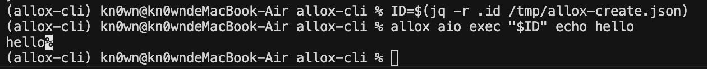
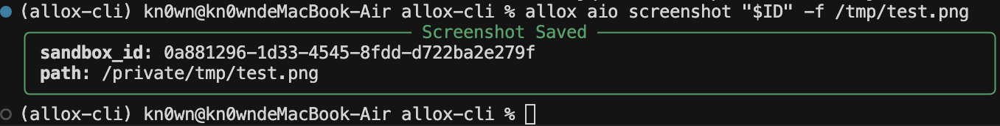

# 阶段 1 测试记录

> 对应历史 Allox 1.0 `ROADMAP.md` 阶段 1（最小可用 CLI）；保留作回归资料。  
> 本文汇总自动化测试与手工验证结果，并保留**实际终端输出**便于对照回归。

**文档版本**：与 `allox-cli` v0.1.0 同步  
**最近更新**：2026-06-01（输出摘录于本机 `darwin` / Python 3.12.13 实跑）

---

## 1. 测试范围

| 类别 | 说明 | 依赖 |
|------|------|------|
| 单元 / 冒烟 | `pytest`，不连真实沙箱 | 仅 Python + Click |
| 集成（`@integration`） | 完整生命周期 | Docker、AIO 镜像、`opensandbox-server` @ `localhost:8080` |
| ROADMAP 1.5 手工验收 | 与集成用例等价，可人工逐步执行 | 同上 |

---

## 2. 自动化测试

### 2.1 执行命令

```bash
cd allox-cli
uv run pytest -q                              # 默认排除 integration
uv run pytest -q -m "not integration" -v      # 单元 + 冒烟，带用例名
uv run pytest -m integration -v -rs         # 集成，并打印 skip 原因
```

### 2.2 单元 / 冒烟：完整 pytest 输出（2026-06-01）

```text
============================= test session starts ==============================
platform darwin -- Python 3.12.13, pytest-9.0.3, pluggy-1.6.0
rootdir: /Users/kn0wn/Desktop/Agent/allox-cli
configfile: pyproject.toml
collected 8 items / 1 deselected / 7 selected

tests/test_aio_commands.py::test_aio_jupyter_help PASSED                 [ 14%]
tests/test_aio_commands.py::test_aio_browser_help PASSED                 [ 28%]
tests/test_aio_commands.py::test_sandbox_create_has_env_option PASSED    [ 42%]
tests/test_cli_help.py::test_cli_help PASSED                             [ 57%]
tests/test_cli_help.py::test_sandbox_help PASSED                         [ 71%]
tests/test_utils.py::test_parse_duration_minutes PASSED                  [ 85%]
tests/test_utils.py::test_parse_nullable_duration_none PASSED            [100%]

======================= 7 passed, 1 deselected in 0.02s ========================
```

说明：`test_integration_e2e.py` 在默认 `pytest -q` 下被 **deselected**（未执行），不是失败。

### 2.3 集成测试：完整 pytest 输出（本机无 Server）

```text
collected 8 items / 7 deselected / 1 selected

tests/test_integration_e2e.py::test_e2e_sandbox_lifecycle SKIPPED (O...) [100%]

=========================== short test summary info ============================
SKIPPED [1] tests/test_integration_e2e.py:39: OpenSandbox server not reachable at localhost:8080
======================= 1 skipped, 7 deselected in 2.04s =======================
```

跳过发生在 `require_server` fixture：对 `http://localhost:8080/` 的探测在约 2s 内失败（连接被拒绝）。

### 2.4 用例与断言（对照表）

| 文件 | 用例 | 断言要点 |
|------|------|----------|
| `test_cli_help.py` | `test_cli_help` | `exit_code == 0`，`"sandbox"`、`"aio"` ∈ stdout |
| `test_cli_help.py` | `test_sandbox_help` | `"create"` ∈ stdout |
| `test_aio_commands.py` | `test_aio_jupyter_help` | `"run"` ∈ `aio jupyter --help` |
| `test_aio_commands.py` | `test_aio_browser_help` | `"info"` ∈ `aio browser --help` |
| `test_aio_commands.py` | `test_sandbox_create_has_env_option` | `"--env"` 或 `"-e"` ∈ `sandbox create --help` |
| `test_utils.py` | `test_parse_duration_minutes` | `parse_duration("30m")` → 1800s |
| `test_utils.py` | `test_parse_nullable_duration_none` | `"none"` / `"NONE"` → `None` |
| `test_integration_e2e.py` | `test_e2e_sandbox_lifecycle` | 见 §5（需真实沙箱） |

---

## 3. CLI 实际输出摘录
`allox config show` 指令查看 allox 指令相关 config 配置

### 3.1 `allox --help`（尾部）

```text
  v0.1.0 — OpenSandbox + AIO

Usage: allox [OPTIONS] COMMAND [ARGS]...

  Allox — manage AIO agent sandboxes on OpenSandbox.

Options:
  --api-key TEXT
  --domain TEXT
  --protocol [http|https]
  --request-timeout INTEGER
  --use-server-proxy / --no-use-server-proxy
  --config PATH
  --no-color
  --version
  -h, --help

Commands:
  aio      Agent tools inside an AIO sandbox (shell, file, browser).
  config   Manage ~/.allox/config.toml.
  sandbox  Manage sandboxes on OpenSandbox.
```

### 3.2 `sandbox create --help`（关键选项行）

```text
  -t, --timeout TEXT             Lifetime e.g. 30m, or none.
  -m, --metadata <TEXT TEXT>...
  -e, --env <TEXT TEXT>...       Environment KEY=VALUE (repeatable).
  -o, --output [table|json]      Output format (table, json).
```

### 3.3 `aio jupyter run --help`

```text
Usage: allox aio jupyter run [OPTIONS] SANDBOX_ID

  Execute Python code via the AIO Jupyter kernel.

Options:
  -c, --code TEXT          Python code to execute.  [required]
  --timeout INTEGER        Execution timeout in seconds.
  --session-id TEXT        Reuse an existing Jupyter session.
  -o, --output [raw|json]  Output format (raw, json).
```

### 3.4 `config show -o json`（成功，exit 0）

`config` 子命令使用独立上下文，`resolved.domain` 可能为 `null`（未合并文件），但 `file.connection` 仍反映磁盘上的配置：

```json
{
  "config_path": "/var/folders/.../T/config.toml",
  "resolved": {
    "api_key": null,
    "domain": null,
    "protocol": "http",
    "request_timeout": 30,
    "use_server_proxy": false,
    "color": true,
    "default_image": "ghcr.io/agent-infra/sandbox:latest",
    "default_timeout": "30m",
    "default_entrypoint": ["/opt/gem/run.sh"],
    "aio_port": 8080
  },
  "file": {
    "connection": {
      "domain": "localhost:8080"
    }
  }
}
```

日常沙箱操作建议用 `allox config set connection.domain localhost:8080` 后，通过 **`sandbox` / `aio` 子命令**（会走 `resolve_config`）验证连接。

### 3.5 `sandbox create -o json`（本机无 Server，exit 1）

日志前部为 httpx 连接 `localhost:8080` 失败的长堆栈，**末尾**为 CLI 收敛后的错误行：

```text
httpx.ConnectError: [Errno 61] Connection refused
Sandbox error [INTERNAL_UNKNOWN_ERROR]: None
```

说明：`handle_errors` 已捕获 `SandboxException` 并打印 `code`；Server 未启动时表现为连接拒绝。

### 3.6 环境探测（与 skip 原因一致）

```bash
curl -s -m 2 http://localhost:8080/
# （无响应 / 连接失败）

docker info
# Cannot connect to the Docker daemon ... docker.sock
```

---

## 4. 集成 / 1.5：期望输出（平台就绪时）


### 4.1 `allox sandbox create -o json`

```bash
allox sandbox create -o json --timeout 5m
```

```json
{
  "id": "ff2b5693-5c8c-480d-bbe5-6beb1c2672ef",
  "image": "ghcr.io/agent-infra/sandbox:latest",
  "aio_url": "http://127.0.0.1:41163",
  "entrypoint": "/opt/gem/run.sh"
}
```

### 4.2 `allox aio exec <id> echo hello`

```bash
ID=$(jq -r .id /tmp/allox-create.json)
allox aio exec "$ID" echo hello
```

**实测结果**（2026-06-03，sandbox `ff2b5693-…` / 后续复跑同流程）：

- exit code: `0`
- stdout（raw）：`hello`（无换行时 shell 提示符会紧跟 `%`）

终端实录见 `assert/echo.png`：



JSON 模式：

```bash
allox aio exec "$ID" echo hello -o json
```

```json
{
  "output": "hello\n",
  "exit_code": 0
}
```

### 4.3 `allox aio screenshot <id> -f /tmp/test.png`

```bash
allox aio screenshot "$ID" -f /tmp/test.png
```

**实测结果**（2026-06-03，sandbox `0a881296-1d33-4545-8fdd-d722ba2e279f`）：

- exit code: `0`
- Rich Panel 含 `sandbox_id`、`path`（macOS 上 `/tmp` 解析为 `/private/tmp/...`）
- PNG 文件非空

终端实录见 `assert/screenshot.png`：



> 注意：保存路径用 **`-f` / `--file`**；**`-o`** 仅用于 `-o json` 等输出格式，勿与文件路径混用。

### 4.4 `allox aio jupyter run <id> -c "print(2+2)" -o json`

期望 JSON 片段（集成断言 `status == "ok"`）：

```json
{
  "kernel_name": "python3",
  "session_id": "2d7649fe-855d-438e-9082-67ba22a6f2a4",
  "status": "ok",
  "execution_count": 1,
  "outputs": [
    {
      "output_type": "stream",
      "name": "stdout",
      "text": "4\n",
      "data": null,
      "metadata": {},
      "execution_count": null,
      "ename": null,
      "evalue": null,
      "traceback": null
    }
  ],
  "code": "print(2+2)",
  "msg_id": "62bac8a1-f018cf6e48af8bfdd5be02fb_100_3"
}
```

### 4.5 `allox aio browser info <id> -o json`

```json
{
  "sandbox_id": "c9398123-796f-4897-b063-793795afa64f",
  "cdp_url": "ws://127.0.0.1:42529/cdp/devtools/browser/b6a2b989-64bc-4c5c-9c4f-e5a78ce9e61d",
  "vnc_url": "http://127.0.0.1:42529/vnc/index.html",
  "cdp_ui_url": null,
  "user_agent": "Mozilla/5.0 (Macintosh; Intel Mac OS X 10_15_7) AppleWebKit/537.36 (KHTML, like Gecko) Chrome/140.0.0.0 Safari/537.36",
  "viewport": {
    "width": 1280,
    "height": 1024
  }
}
```

### 4.6 `allox sandbox kill <id> -o json`

```json
{
  "id": "c9398123-796f-4897-b063-793795afa64f",
  "status": "killed"
}
```

---

## 5. 功能覆盖对照（ROADMAP 阶段 1）

| 功能 | 文档中的实际依据 |
|------|------------------|
| `sandbox create` + `--env` / `--metadata` / `--timeout none` | §3.2 help 行 + §2.2 通过 |
| `aio jupyter run` / `browser info` | §3.3 help + §4.4–4.5 期望 |
| `-o json` | §3.4–3.5、§4 |
| 错误信息可读 | §3.5 末尾 `Sandbox error [...]` |
| 1.5 端到端 | §4（含 `assert/` 截图） |

---

## 6. 解除阻塞后复现

```bash
# 终端 1
docker pull ghcr.io/agent-infra/sandbox:latest
opensandbox-server

# 终端 2
cd allox-cli
allox config set connection.domain localhost:8080

# 建议：先手工跑一遍并保存输出
allox sandbox create -o json --timeout 5m | tee /tmp/allox-create.json
ID=$(jq -r .id /tmp/allox-create.json)
allox aio exec "$ID" echo hello
allox aio screenshot "$ID" -f /tmp/test.png
allox aio jupyter run "$ID" -c 'print(2+2)' -o json
allox aio browser info "$ID" -o json
allox sandbox kill "$ID" -o json

# 再跑集成
uv run pytest -m integration tests/test_integration_e2e.py -v -rs
```

ROADMAP 1.5 勾选清单（实跑通过后打勾）：

- [ ] `allox sandbox create -o json` → 记录 `id`、`aio_url`
- [ ] `allox aio exec <id> ls -la` 或 `echo hello`
- [ ] `allox aio screenshot <id> -f test.png`
- [ ] `allox sandbox kill <id>`
- [ ] 全程不启动 `osb`

---

## 7. 测试基础设施说明

- **`tests/conftest.py`**：`CliRunner` 自动加 `--config <tmp>/config.toml`，避免损坏的 `~/.allox/config.toml` 影响 help 测试。
- **无效 config**：加载失败时提示 `Invalid config file ...`（`ClickException`），不再裸抛 `TOMLDecodeError`。
- **`integration` 标记**：见 `pyproject.toml` `[tool.pytest.ini_options] markers`。

---

## 8. 回归检查清单

1. `uv run pytest -q -m "not integration"` → 输出应含 `7 passed`（见 §2.2）。  
2. 平台就绪：`uv run pytest -m integration -v` → `1 passed`（见 §4.7）。  
3. 对照 §3 的 help / 错误尾部是否仍一致。  
4. Server 端口与 `connection.domain` 均为 **8080**（OpenSandbox），勿与文档外的 8090 混用。

---

## 9. 相关文件

| 路径 | 用途 |
|------|------|
| `tests/test_cli_help.py` | 根 / sandbox help |
| `tests/test_aio_commands.py` | aio 子命令 help |
| `tests/test_utils.py` | 时长解析 |
| `tests/test_integration_e2e.py` | 端到端 |
| `tests/conftest.py` | 隔离配置 |
| `assert/echo.png` | §4.2 `aio exec echo hello` 终端实录 |
| `assert/screenshot.png` | §4.3 `aio screenshot -f` 终端实录 |
| [README.md](../../../README.md) | 当前命令用法与 2.0 架构 |
| 历史 `ROADMAP.md` | 1.0 阶段任务；不再属于当前主文档 |
