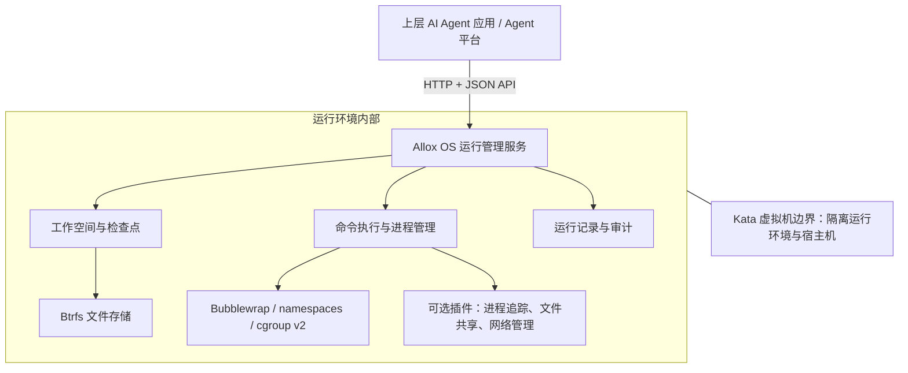

# Allox OS 项目介绍

> **Allox OS 是面向 AI Agent 的执行环境管理底座，让 Agent 执行任务时拥有独立工作空间，并支持文件状态保存、错误回退和运行过程追踪。**

## 1. 项目是做什么的

AI Agent 在实际工作中，需要修改代码、运行脚本、处理数据和生成文件。这些操作需要一个可管理的执行环境：多个任务的文件要分开，执行出错后要能恢复，运行过程要能查询。

Allox OS 负责管理这个环境，为上层 Agent 应用提供工作空间、命令执行、隔离、检查点、回退和审计能力。上层 Agent 决定执行什么任务，Allox OS 负责承载执行过程并管理产生的文件和进程。

**可以将它理解为 AI Agent 的“独立工作间 + 文件存档 + 执行记录”。** 项目面向 Agent 平台和应用开发团队，通过 API 接入现有 Agent 框架。

当前仓库主要实现虚拟机内部的运行管理服务及插件，产品形态是后端基础设施。

## 2. 解决什么问题

| Agent 落地中的问题 | Allox OS 提供的能力 | 带来的价值 |
|---|---|---|
| 多个任务共用目录，文件容易混杂 | 按 Agent 和会话分配独立工作空间 | 便于并行开展多个任务，减少文件相互影响 |
| Agent 修改出错后，恢复原始文件困难 | 创建检查点，按会话恢复文件状态 | 降低试错和返工成本 |
| 脚本启动子进程后，来源和生命周期难管理 | 将执行及其后代进程归属到会话，支持查询和终止 | 便于定位异常、清理遗留进程 |
| 难以还原一次任务的执行过程 | 保存运行状态、标准输出、错误输出及操作审计 | 支持排障和过程复盘 |
| 多个 Agent 需要交换结果，但不宜直接开放全部目录 | 通过可选插件限定共享目录和读写权限 | 支持受控的文件协作 |
| 不同任务对联网的要求不同 | 通过可选插件提供断网隔离或代理出站 | 按任务需要配置网络环境，集中记录出站访问 |

## 3. 核心功能

### 3.1 多 Agent、多会话工作空间

系统按两层组织任务文件：Agent 对应长期工作身份，Session（会话）对应一次独立任务。每个会话拥有自己的当前文件和检查点，同一 Agent 还可以通过共享目录保存公共资料。

例如，一个编程 Agent 可以同时拥有“修复登录问题”和“开发搜索功能”两个会话。回退其中一个会话的文件，不会回退另一个会话或 Agent 的公共目录。

### 3.2 文件检查点与回退

在关键步骤保存会话文件状态，出错后恢复到指定检查点。检查点基于 Btrfs 写时复制快照，创建时共享已有数据块，后续修改才占用新增数据空间，避免每次完整复制工作目录。

系统支持检查点列表、描述、历史分支和固定保留。回退过程带有事务记录，服务启动时可以处理被中断的恢复操作；审计记录保存在回退范围之外，便于继续追溯操作历史。

**回退范围是指定会话的文件状态。** 进程内存、网络连接，以及已写入外部数据库或外部服务的结果不在恢复范围内。

### 3.3 命令执行与进程管理

启用执行服务后，上层应用可提交命令，设置超时时间，查询执行状态和输出，并停止任务。系统按会话管理进程及其后代，帮助识别任务归属和清理遗留进程。

执行、检查点与回退之间设有互斥协调，避免文件恢复与受管理执行发生冲突。回退前终止会话进程属于可选配置，默认关闭。

### 3.4 执行环境隔离

架构采用两层隔离：Kata 虚拟机提供运行环境与宿主机之间的边界；虚拟机内通过 Bubblewrap、Linux namespaces 和 cgroup v2 管理会话的文件视图与进程。

受管理命令在指定工作空间内执行，拥有私有临时目录，系统目录以只读方式挂载，启动时移除 Linux 特权能力。网络隔离由可选插件提供，需要单独启用。

### 3.5 执行记录与审计

系统保存命令运行状态、标准输出、错误输出，以及检查点、回退等操作记录。启用 eBPF 插件后，还可记录进程创建、程序执行和退出事件，辅助分析进程树及其来源。

这些记录可供上层平台用于排障、展示任务进度和复盘执行过程。

### 3.6 自动保存与平台接入

项目通过 HTTP + JSON API 提供 Agent、会话、检查点、回退和执行管理接口，并支持 Bearer token 认证。

上层 Agent 框架接入生命周期适配器后，可以在会话开始时创建基线检查点，并在每轮交互结束时保存文件状态，形成随任务推进积累的恢复记录。自动保存支持关闭，需要上层框架主动接入。

### 3.7 按需启用的扩展插件

| 插件 | 提供的功能 | 使用场景 |
|---|---|---|
| 进程树追踪 `allox-process-tree` | 基于 eBPF 采集进程创建、执行、退出事件 | 排查复杂脚本、追踪后代进程 |
| 会话文件共享 `allox-session-share` | 按共享范围转发文件读写，默认只读，双方需开启共享 | 多 Agent 交换报告、代码片段和任务产物 |
| 会话网络管理 `allox-session-network` | 独立网络空间，支持隔离模式或代理出站模式 | 离线任务执行、需要记录出站访问的任务 |

插件独立打包，安装后还需显式启用。核心服务负责加载插件、组合执行配置并检查冲突。

## 4. 典型使用场景

以下为基于现有能力的应用场景，上层任务逻辑由接入的 Agent 应用提供。

| 场景 | 使用方式 |
|---|---|
| AI 编程助手 | 修改前保存检查点，执行代码修改和测试；结果不符合预期时恢复文件，再尝试其他方案 |
| 数据分析与自动化脚本 | 为每个任务分配独立目录，管理输入、输出和执行日志，便于定位失败原因 |
| 多 Agent 协作 | 不同 Agent 分别处理子任务，通过共享插件交换指定范围内的文件 |
| Agent 平台基础设施 | 将工作空间、执行、恢复与审计作为统一服务，供多个上层 Agent 应用调用 |

以 AI 修复代码为例，完整流程为：

1. 平台创建 Agent 和任务会话，准备项目文件。
2. 保存修改前的检查点。
3. Agent 修改代码、执行测试，Allox OS 管理命令并保存运行记录。
4. 修改符合预期后，保存新的检查点；出现问题时，恢复到此前的文件状态。
5. Agent 基于恢复后的文件继续尝试，平台仍可查看历史执行记录。

## 5. 整体架构

一个运行环境可承载多个 Agent 和会话；会话在环境内部独立管理，无需为每个会话单独启动一台虚拟机。当前仓库的代码重点是图中的运行管理服务、文件存储管理、执行管理及插件。

## 6. 技术栈

| 技术层 | 技术选型 | 在项目中的作用 |
|---|---|---|
| 核心开发语言 | Python ≥ 3.10 | 实现工作空间服务、执行管理和插件接口 |
| 服务与接口 | Python 标准库 `ThreadingHTTPServer`、HTTP + JSON RPC | 对外提供管理 API，供 Agent 平台接入 |
| 文件状态管理 | Btrfs 子卷、只读快照、写时复制 | 管理会话文件、保存检查点和执行回退 |
| 虚拟机隔离 | Kata，当前架构采用的运行时后端 | 提供 Guest 与宿主机之间的隔离边界 |
| 会话执行隔离 | Bubblewrap、Linux namespaces、Linux capabilities | 限定文件和进程视图，移除执行特权 |
| 进程生命周期 | cgroup v2、Python subprocess、Linux 信号 | 管理进程归属、超时与整组终止 |
| 深度进程观测（可选） | C、eBPF、libbpf、Clang、bpftool | 在内核侧采集进程事件 |
| 本地服务通信 | Unix domain socket | 承载文件共享和网络代理转发 |
| 元数据与一致性 | JSON / JSONL、线程锁、文件锁、回退事务日志 | 保存索引与审计，协调修改和中断恢复 |
| 插件与打包 | Python entry points、Hatchling、wheel | 核心与插件独立分发、按需加载 |
| 开发与质量检查 | uv、pytest、Ruff | 依赖管理、测试和静态检查 |

核心包未声明第三方 Python 运行时依赖，但实际运行依赖 Linux、Btrfs 及按功能配置的系统工具。当前接口以 API 为主，仓库未提供面向终端用户的聊天界面或管理前端。

## 7. 当前实现范围

当前仓库已提供工作空间与检查点管理、文件回退、执行协调、受管理命令执行、审计记录、生命周期适配器，以及三个可选插件的代码实现。完整使用需要准备符合要求的 Linux 运行环境，并接入上层 Agent 应用。

## 8. 技术参考

- [项目 README](README.md)
- [架构总览](docs/architecture/overview.md)
- [工作空间模型](docs/architecture/workspaces.md)
- [可选插件](plugins/README.md)
- [部署边界](deploy/README.md)
- [项目依赖与打包配置](pyproject.toml)
